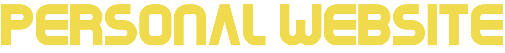

   
    
    <h3>hendriktreuner.me</h3>
  

   
  

## Live Version

This website can be found [here](https://hendriktreuner.me/)

## Description

My personal portfolio website.
Here I share all my work and projects I am working on.

## Functionality

Navigate via the landing page to the all the custom projects
Current project list:

1. Food Order App
2. Personal Website [This](https://hendriktreuner.me/)
3. Weather App
4. Portfolio Manager

## How to install

-   Download this repo
-   Unpack the zip file
-   cd into the 'deploy' folder
-   open the 'index.html' in your prefered browser

## License

MIT License
